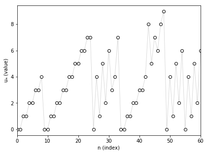
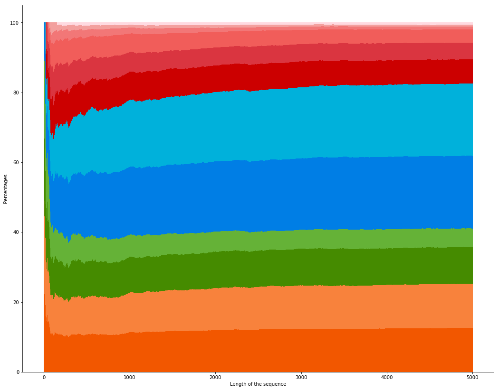

# Nim functions for take-a-X game

The Nim functions for take-a-X game is a collection of math sequences with interesting patterns.
For a clear definition, you can check out the description here (for the set of prime numbers): https://ahstat.github.io/Nim-take-a-prime/

This code takes a sequence and outputs the related Nim sequence. After that, some descriptive plots are shown.

For now, the code is applied only on the set of prime numbers. You can retrieve the sequence in the `outputs/primes/nims` folder. This sequence is called Nim function for take-a-prime (A014589).

**First elements of the sequence**

One can show the first elements of A014589:

 

**Stacked plot**

We can also check the proportions to obtain values from 0 to 11 as the length of the sequence increases. The following proportions are stacked: 0 is on the bottom (in dark orange) and 11 is on the top (in pink).

 